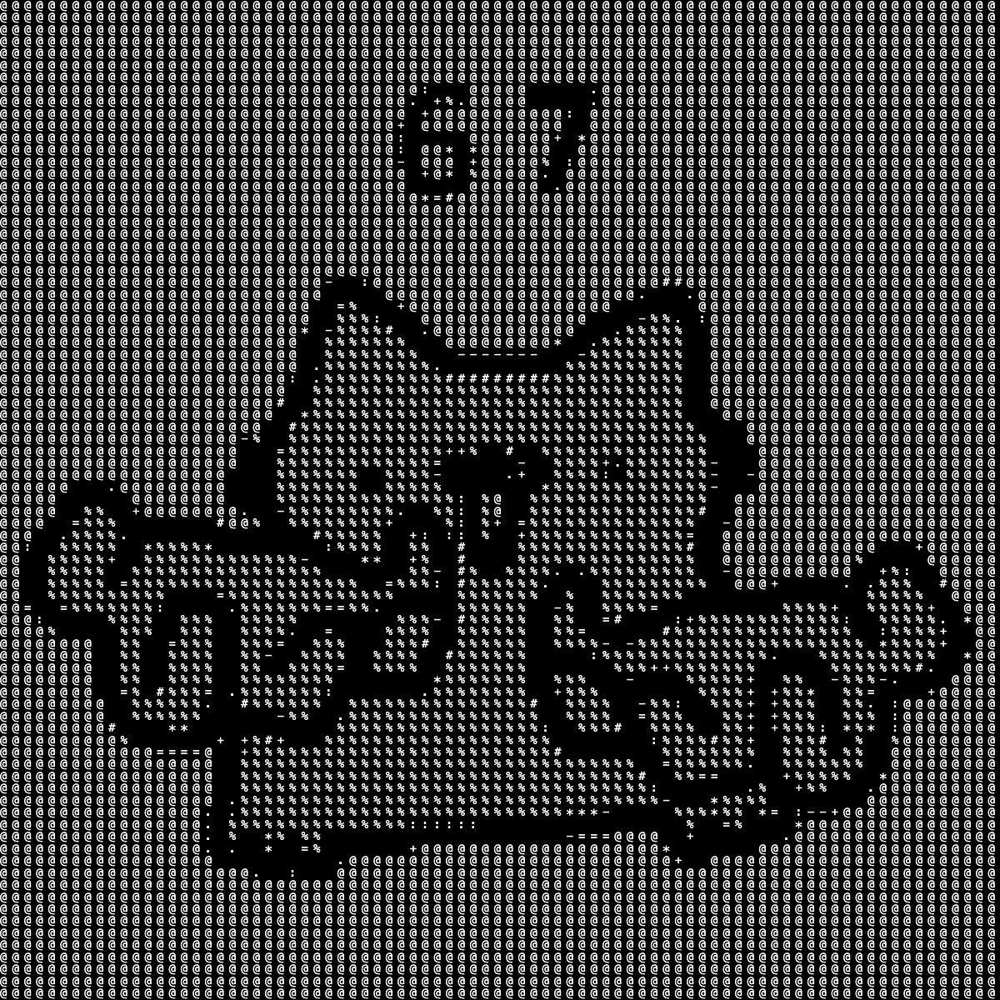

<picture>
  <source media="(prefers-color-scheme: dark)" srcset="dark_mode.svg" />
  <source media="(prefers-color-scheme: light)" srcset="light_mode.svg" />
  
</picture>

# Daksh Srivastava

**Full-Stack Developer & Software Builder**  
Kharghar, Navi Mumbai, India · ITM Skills University · GitHub Pro

 

---

## About Me

I build full-stack web applications, mobile apps, and developer tools with clean UI and fast backends. I like turning ideas into real products and experimenting with modern tech like 3D audio, on-device AI, and automated workflows.

- **Full-Stack Development**: Building fast, accessible apps with TypeScript, React, Next.js, and Node.js.
- **AI & Developer Tools**: Crafting practical AI assistants and developer utilities with Ollama, ChromaDB, and Python.
- **Mobile & Cross-Platform**: Creating offline-first mobile apps using Flutter and Dart.
- **Creative Web Tech**: Experimenting with Web Audio API for spatial audio and Three.js for interactive web experiences.

---

## Current Focus

- **Building**: Enhancing `Contradiction-MCP` with automated conflict detection across knowledge bases.
- **Exploring**: Go concurrency patterns and high-performance browser graphics with WebGPU.
- **Learning**: Distributed system architectures, consensus primitives, and local vector indexing pipelines.

---

## Featured Projects

| Project | Description | Stack |
| :--- | :--- | :--- |
| **[Contradiction-MCP](https://github.com/Daksh-create349/Contradiction-MCP)** | An open-source AI tool to detect and resolve conflicting information across documentation and knowledge bases. | `TypeScript` `MCP` `AI Tools` |
| **[Sonaura 2.0](https://github.com/Daksh-create349/Sonaura-2.0)** | A browser-based audio tool that intercepts tab audio to deliver cinema-grade 3D spatial sound to headphones. | `JavaScript` `Web Audio API` `DSP` |
| **[Indian Legal Aid Navigator](https://github.com/Daksh-create349/Indian-Legal-Aid-Navigator)** | An AI legal assistant that helps citizens navigate legal questions using local search and open-source models. | `Python` `ChromaDB` `Ollama` |
| **[AgroSentry AI](https://github.com/Daksh-create349/AGROSENTRY)** | An offline mobile app that detects plant and crop diseases directly on the device using computer vision. | `Flutter` `Dart` `Edge AI` |
| **[Company-Brain](https://github.com/Daksh-create349/Company-Brain)** | An automated tool for matching vendor invoices with purchase orders to simplify logistics accounting. | `Python` `Document AI` `Agents` |
| **[Github-Guardian](https://github.com/Daksh-create349/Github-Guardian)** | Automated security and branch policy enforcement tool for GitHub repositories. | `JavaScript` `GitHub Actions` |

---

## Tech Stack

### Languages

### Frontend & Mobile

### Backend & Databases

### Tools & AI

---

## Open Source Highlights

- **Model Context Protocol (MCP)**: Building open tooling and standardized servers for developer workflows.
- **Client-Side DSP**: Experimenting with browser-native Web Audio nodes for spatial 3D audio.
- **Collaborative Shipping**: 40+ merged pull requests across personal and open-source codebases with a 2x Pull Shark award.

---

## Writing & Notes

<!-- BLOG-POST-LIST:START -->
- [Understanding Model Context Protocol (MCP) for Developers](https://dakshsportfolio.vercel.app/) — Key patterns and practical use cases for AI tooling.
- [Building 3D Spatial Audio in the Browser with Web Audio API](https://dakshsportfolio.vercel.app/) — Technical breakdown of PannerNodes and binaural listening.
- [Setting Up Local-First RAG with ChromaDB and Ollama](https://dakshsportfolio.vercel.app/) — Practical guide to running private vector search pipelines.
<!-- BLOG-POST-LIST:END -->

---

## GitHub Activity & Highlights

- **87+ Repositories**: Covering web apps, mobile projects, developer tools, and experiments.
- **1,200+ Contributions**: Active year-round across personal projects and open source.
- **1,000+ Commits**: Regular, consistent production commits.
- **40+ Merged Pull Requests**: Contributing, collaborating, and shipping code.
- **Badges**: GitHub Pro Verified · 2x Pull Shark Awardee.

<picture>
  <source media="(prefers-color-scheme: dark)" srcset="snake-dark.svg" />
  <source media="(prefers-color-scheme: light)" srcset="snake-light.svg" />
  
</picture>

---

  
    
  <code>[routine] code · test · ship · repeat</code>

